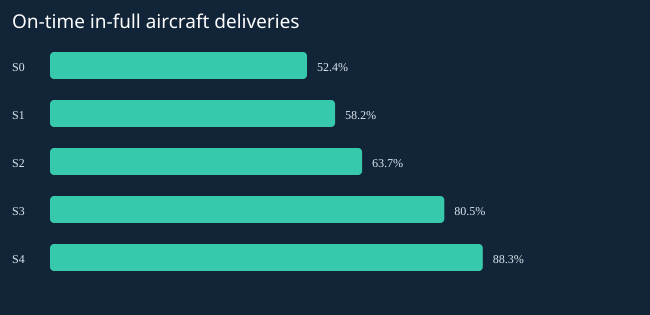

# Aerospace IBP & Recovery Planning Simulator

**AeroPlan Manufacturing — an entirely fictional aerospace OEM.** A reproducible Python and SQL portfolio project that turns a Week-10 disruption into a finite production plan, an evidence trail, and a cost-aware recovery decision.

> **Synthetic data only.** No Airbus, airline, supplier, customer, confidential, or external operational data is used. Product names, capacities, routes, costs and demand are invented. This is an independent learning project demonstrating SAP IBP-style planning concepts; it does **not** run SAP IBP, reproduce Airbus processes, or imply affiliation or certification.

## Start here

- **Decision maker:** [generated executive brief](artifacts/executive_insights.md) and [scenario comparison](artifacts/csv/scenario_evaluation.csv).
- **Recruiter:** start with the business question below and the [generated executive brief](artifacts/executive_insights.md).
- **Technical reviewer:** [model and KPI methodology](docs/methodology.md), [tests](tests/test_simulator.py), [SQL analytics](sql/analytics.sql).
- **Dashboard builder:** [four-page Power BI specification](powerbi/dashboard_spec.md), [DAX measures](powerbi/measures.dax), [theme](powerbi/theme.json).
- **Quick visual:** open [artifacts/index.html](artifacts/index.html) locally in a browser. GitHub displays HTML source; download/clone to view. This generated HTML report is separate from the Power BI specification. No `.pbix` is claimed or included.



## The business question

How should a planner protect aircraft deliveries when a critical source loses capacity while narrow-body demand rises—without inventing new suppliers or ignoring the factory's limits?

The experiment covers AP-100 narrow-body single-aisle, AP-200 medium-body and AP-300 wide-body long-range aircraft over **26 weekly execution/replanning cycles**. Customer orders, forecast uncertainty, component availability, manufacturing and transportation lead times, existing source capacity and final assembly line (FAL) hours are balanced together.

Planning scope is explicit: select transport mode, allocate volume within an **already qualified** secondary source's fixed capacity, and resequence assembly. There is no procurement, supplier creation, qualification, vendor evaluation, technical component assessment, negotiation or sourcing workflow.

## Run in under a minute

Requires Python **3.9+** with SQLite window-function support (SQLite 3.25+). The runtime and tests use only the Python standard library. No credentials, network, paid API or package installation is required.

```bash
git clone https://github.com/aimiaosu-blip/aerospace-ibp-recovery-simulator.git
cd aerospace-ibp-recovery-simulator
python3 -m aeroplan --seed 42 --output artifacts
python3 -m unittest discover -s tests -v
```

If using the local delivery before publication, enter the supplied repository directory and run the last two commands. On Windows use `python` in place of `python3` if needed. Avoid Python's `-O` switch: validation uses assertions.

The run generates eight requested datasets plus supporting dimensions and result facts, executes an undisrupted reference and five alternatives, validates every plan, builds `artifacts/aeroplan.sqlite`, exports SQL views to CSV, and writes the executive brief, root-cause evidence, sensitivity results and local HTML summary. Re-running replaces generated outputs deterministically. SHA-256 hashes of all CSV files are in `artifacts/manifest.json`.

```bash
# Test another demand/forecast seed without changing the committed reference run:
python3 -m aeroplan --seed 101 --output scratch/seed101
# Optional SQLite CLI (not needed by Python):
sqlite3 artifacts/aeroplan.sqlite 'SELECT * FROM weekly_kpi WHERE scenario=0 AND week>=10;'
```

## End-to-end IBP workflow


## Reference, disruption and recovery

The reference is scenario **-1**, not scenario 0. Scenario 0 receives the disruption but takes no recovery action. All five recovery alternatives face the **same disrupted orders** and share reference execution through Week 9.

At Week 10, the primary airframe source's **available** release capacity falls by **40% for four weeks**. The fixed master remains unchanged. AP-100 demand due in Weeks 10–26 rises by approximately **15%**, using cumulative integer rounding because fractional aircraft cannot be delivered. Extra orders become known at Week 10. A three-week manufacturing lead time plus two-week standard transportation time carries the supplier shortfall to receipts in Weeks 15–18.

|Scenario|Permitted planner action|Limits retained|
|---|---|---|
|0 — No action|Continue committed release policy and due-date scheduling|All source, material, FAL and transport constraints|
|1 — Expedite|Use the existing one-week express lane for critical releases from Week 10|Express lane capacity; no manufacture-time reduction or extra supply|
|2 — Existing secondary allocation|Reallocate lost primary volume and incremental airframe need to S-A2|Already qualified, four shipsets/week, existing lead time|
|3 — Reschedule|Prioritize due/backlog orders by priority; prebuild known orders up to two weeks early when resources remain|No overtime, new line, extra material or master changes|
|4 — Integrated|Combine the three approved planning levers|Same individual limits and cost rules|

The decision framework weighs **OTIF 30%, backlog exposure reduction 25%, inventory stability 15%, incremental recovery cost 20%, operational risk 10%**. Scores use transparent benefit/cost normalization; service-first and cost-cautious sensitivity profiles are also calculated. No winning scenario or outcome is hardcoded. [The generated brief](artifacts/executive_insights.md) is the source of current seed-specific numbers.

The experiment exposes a useful trade-off: prioritization may improve the share of orders delivered on time without reducing total aircraft backlog. Faster transportation shifts receipt timing but cannot replace lost component volume. Existing secondary allocation helps volume, yet residual engine/avionics or FAL constraints can still prevent full recovery.

## Model assumptions and boundaries

- **Time:** 26 fixed weekly buckets, rolled forward one week at a time with inventory and unfinished orders carried forward. This is a bounded experiment with a shrinking remaining horizon, not an indefinitely extended 26-week horizon. Future forecast vintages are archived; the committed supply schedule uses vintage 1.
- **Demand:** one aircraft per order, all original orders known at Week 1. Forecast and booked orders are consumed by `max(booked, rounded forecast)` per product-week, never added together. Firm orders drive delivery eligibility; excess forecast supply can remain as inventory.
- **Assembly:** one bucket per aircraft; three families share one hour-based FAL pool. The duration and BOM are deliberately simplified planning abstractions, not engineering representations. Delivery occurs at assembly completion; early completion is accepted as on time.
- **Supply:** homogeneous components, no substitution, quality loss or yield uncertainty. Weekly release capacity is a simplified throughput constraint, not detailed upstream shop-floor scheduling. Pre-horizon pipeline releases are explicitly recorded; no receipt can precede manufacturing plus transportation lead time.
- **Control:** masters remain fixed. Source availability changes only through the disruption event. No spontaneous overtime, supplier expansion or expedited manufacturing.
- **Planning algorithm:** deterministic feasible greedy heuristic. It proves the returned plan respects modeled constraints; it does not prove global optimality.
- **Costs:** fictional incremental USD only; no total aircraft margin, procurement spend, holding cost or missed-delivery penalty model. Operational risk is an explicit proxy, not a failure probability.
- **Horizon:** unfilled orders are retained as ending backlog and count against OTIF. Delays on open orders are censored at Week 26. Stock coverage is blank when no remaining future demand denominator exists.

See [methodology](docs/methodology.md) for equations, tie-break rules, time ordering, causal limits and extension ideas.

## Dataset dictionary

All files are regenerated under `artifacts/csv/` and are also SQLite tables/views.

|Requested dataset|Grain / key|What it contains|
|---|---|---|
|`customer_orders`|Original `order_id`|Family, unit quantity, due week, priority, information availability|
|`demand_forecast`|Vintage × target week × family|Seeded fractional forecast with archived weekly vintages|
|`aircraft_bom`|Family × component|Fixed integer consumption per aircraft|
|`suppliers`|Supplier ID|Component, qualification, fixed release capacity, manufacturing lead time|
|`inventory`|Component|Opening on-hand and target coverage|
|`production_capacity`|Week|Shared FAL available hours and ramp-up|
|`production_plan`|Scenario × week × family|Feasible output, demand, backlog, reference deviation, due-order service|
|`transportation`|Supplier|Fixed standard/express lead times and express lane capacity|

Supporting facts: `supply_shipments`, `material_balance`, `order_fulfillment`, `capacity_execution`, `planning_exceptions`, `scenario_metrics`, `scenario_evaluation`. Dimensions: products, components, weeks, release weeks, scenarios. SQL views include rolling four-week OTIF/WAPE, prioritized order risk, source utilization and exception reporting. [Full grains, fields, units and relationships](docs/data_dictionary.md).

## KPI methodology at a glance

|KPI|Definition / caution|
|---|---|
|OTIF|Complete one-aircraft orders delivered by due week / all orders due in the evaluation horizon; early delivery accepted|
|Backlog|Cumulative due orders minus deliveries of those due orders; do not sum week-end snapshots to get ending backlog|
|Backlog exposure|Sum of weekly backlog = aircraft-weeks; used for recovery scoring|
|Capacity utilization|Used FAL hours / available FAL hours; shared capacity is stored once per scenario-week|
|Plan adherence|`max(0, 1 − sum(abs(actual − reference)) / sum(reference))` across family-week buckets|
|Inventory coverage|Closing units / average BOM demand over the next up-to-four remaining weeks; unknown orders excluded|
|WAPE|Sum absolute vintage-1 forecast errors / sum synthetic booked demand, including uplift after announcement|
|Inventory stability|Inverse of one plus coverage variability plus mean absolute distance from target coverage|
|Recovery cost|Express cost + secondary allocation cost + applicable resequencing proxy cost|
|Operational risk|Documented blend of late/open service exposure and execution complexity; see methodology|

Demand overload is a diagnostic exception, **not an infeasible executed plan**. Material blocking is measured as order-week events; repeat appearances do not imply distinct orders.

## Validation and SQL evidence

The test suite checks seeded reproducibility, seed sensitivity, conservation of inventory and backlog, BOM consumption, lead times, fixed capacity, express lane limits, frozen history, integer demand uplift, no-event equivalence, complete supplier outage, zero post-event FAL capacity, tie handling, cost-sensitive ranking, deliberate data corruption and SQL/Python reconciliation. The full pipeline is run twice and compared by CSV hashes.

`sql/analytics.sql` demonstrates CTEs, `LAG`, `ROW_NUMBER`, `DENSE_RANK`, rolling `SUM ... ROWS BETWEEN 3 PRECEDING AND CURRENT ROW`, safe ratio denominators, and `UNION ALL` exceptions. Keys receive unique indexes in SQLite. The dashboard uses separate fact grains to avoid multiplying factory capacity across product rows.

## Repository map

```text
aerospace-ibp-recovery-simulator/
├── README.md
├── LICENSE
├── requirements.txt                 # Standard library; no third-party runtime packages
├── Makefile
├── .github/workflows/ci.yml         # Python matrix, tests, regeneration, artifacts
├── aeroplan/
│   ├── __main__.py                  # Reproducible end-to-end CLI
│   ├── config.py                    # Frozen inputs, scenario names and policy weights
│   ├── data.py                      # Seeded master data, forecasts and orders
│   ├── supply.py                    # Finite releases and transport receipts
│   ├── planning.py                  # Weekly feasible scheduling and order fulfillment
│   ├── analysis.py                  # KPIs, root causes, scoring and sensitivity
│   ├── validation.py                # Physical/accounting invariants
│   ├── storage.py                   # CSV, SQLite and hash manifest
│   └── reporting.py                 # Dynamic memo, SVG and local HTML
├── sql/analytics.sql
├── tests/test_simulator.py
├── docs/
│   ├── methodology.md
│   ├── data_dictionary.md
│   └── publishing.md
├── powerbi/
│   ├── dashboard_spec.md
│   ├── measures.dax
│   ├── import_csv.pq
│   └── theme.json
└── artifacts/                      # Generated seed-42 evidence; reproducible
    ├── aeroplan.sqlite
    ├── csv/
    ├── manifest.json
    ├── validation.json
    ├── root_causes.json
    ├── sensitivity.json
    ├── executive_insights.md
    ├── scenario_otif.svg
    └── index.html
```

## What this demonstrates

This project provides inspectable evidence of demand–supply balancing, ramp-up capacity planning, time-phased constraint analysis, order-level exception management, scenario governance and executive communication relevant to an aerospace IBP planning role. It is evidence of a synthetic portfolio implementation, **not employment experience, production SAP proficiency, or realized savings**.

Conceptual references (documentation only, not data sources): [SAP supply planning](https://help.sap.com/docs/SAP_INTEGRATED_BUSINESS_PLANNING/c1fb60cb1e9c49d99ada277ae57e9e6c/66a038fcf40f4f779c6b4696aede83a6.html) and [Microsoft Power BI star-schema guidance](https://learn.microsoft.com/en-us/power-bi/guidance/star-schema).
