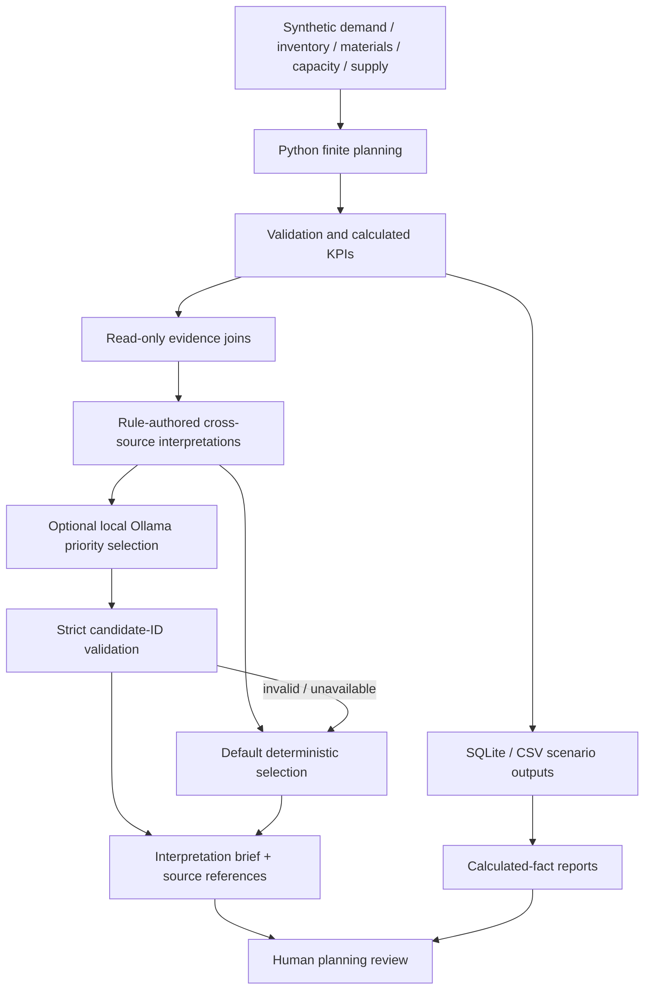

# Planning analytics architecture and evidence boundary

All inputs and outputs are synthetic. No chat interface or external enterprise data
connection is added. The existing planning heuristic, KPI formulas, SQL views,
recovery scoring and approval authority remain unchanged.

## Record and claim lineage

`build_package(tables)` reads the same computed tables exported to SQLite/CSV. Each
source ID is table name plus the table's composite business key, for example
`material_balance:0:15:AIRFRAME`. Its entry preserves the key, source CSV and a copy
of the calculated row. A digest fingerprints all eight contributing tables.
Numbers use the existing storage canonicalization (ten decimal places).

|Candidate|Eligibility / evidence join|Interpretation boundary|
|---|---|---|
|Demand/capacity|Positive overload; production rows joined on scenario/week|Diagnostic demand pressure, not infeasible executed load|
|Material shortage|Positive blocked orders; same scenario/week/component exceptions and their order outcomes|Order-week events, not unique orders across time|
|Supply risk|Available release capacity below master; same scenario/component at arrival week|Observed availability and timing, not causal proof|
|Inventory/backlog|Positive backlog and positive component stock in same scenario/week|Incomplete kits can coexist with inventory; no holding-cost estimate|
|Recovery trade-off|Each alternative's calculated evaluation plus no-action metrics|Python compares KPI direction; score and risk remain policy outputs|

The complete package retains every eligible candidate; the brief is a representative
subset, not an exhaustive exception queue. Default selection takes the first
candidate of each category in engine order. For a model request, context is bounded
to first/middle/last per category with up to four evidence samples per candidate.
The local report always restores the full evidence references for selected IDs.

## Model contract

The optional adapter calls an existing local Ollama `/api/generate` endpoint using
Python's standard library, JSON output and temperature zero. The only accepted
response is `{"selected_ids": ["candidate-id", "..."]}`. Up to twelve unique
existing IDs must collectively cover every available category. Every selected
interpretation and reference is rehydrated from the trusted catalog. Free-form
model prose, numeric fields and partial category coverage are rejected.

`select_insights` passes a deep copy to adapters. Neither an adapter mutation nor
an invalid response can alter the engine's input tables, calculated facts or saved
ranking. This is a data-contract boundary, not a security sandbox for arbitrary
Python adapters. Missing references in the trusted package raise an error rather
than producing an unsupported brief. Transport/schema failures fall back with a
sanitized reason; raw provider output is never rendered.

## Limits and evaluation

LLM assistance is prioritization over deterministic synthesis, not autonomous
reasoning or numerical analysis. This sacrifices free-form discovery to enforce
evidence grounding. The sampled context can miss important within-category
exceptions; inspect the full package before decisions. Selection does not certify
causality, optimum planning or total lifecycle cost. In particular, holding and
missed-delivery costs are unpriced, and operational risk is a proxy.

Tests reconcile every stored source with exactly one SQLite row, resolve every
citation, compare all CSV hashes with/without a mutating adapter, exercise invalid
IDs/extra fields/duplicates/missing categories, and test the local HTTP contract
with a mock. Offline CLI execution and an unavailable-model fallback are exercised.
An actual installed model is optional; inference quality has not been evaluated.
