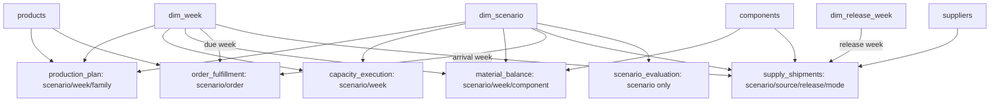

# AeroPlan IBP Control Tower — four-page Power BI build specification

**Deliverable status:** executable Python/SQL data pipeline, CSV exports, Power Query import helper, DAX definitions, theme and this detailed build specification. No `.pbix`/`.pbip` report has been authored or validated in Power BI Desktop. The separate generated HTML report provides a viewable local results summary.

Use a 16:9 canvas (1280 × 720), an 80px top header, a compact left navigation rail, and consistent scenario colors. Import `theme.json`. Show **SYNTHETIC / NOT AIRBUS DATA** in each page footer. State that all costs are fictional USD and units are aircraft, shipsets, components, hours or weeks as appropriate. Avoid decorative aircraft imagery that displaces operational evidence.

## 1. Import and reproducibility

1. Run `python -m aeroplan --seed 42 --output artifacts` from the repository root, then run the test suite.
2. In Power BI Desktop, create a Text parameter `CsvFolder` pointing to the absolute `artifacts/csv` folder. Use `import_csv.pq` as the `LoadAeroPlanCsv` function.
3. Create one query per required CSV with its **exact file base name**, for example `production_plan = LoadAeroPlanCsv("production_plan")`. Use UTF-8 and comma delimiters.
4. Type all identifiers as Text except numeric scenario/week IDs. Type `week`, `release_week`, `arrival_week`, `due_week`, `delivery_week`, `vintage_week`, scenario IDs, priorities, flags, counts and unit quantities as Whole number. Type hours, costs, scores, utilities, coverage, forecasts and rates as Decimal number, using English (United States) for decimal separators. Blank delivery and coverage values must become null, not zero. Leave order IDs such as `O00001` as Text.
5. Load the dimensions and facts below. Helper tables (`customer_orders`, `aircraft_bom`, `inventory`, `transportation`, `production_capacity`, `demand_forecast`) may be loaded as disconnected audit tables or have load disabled. Do not connect the full forecast-vintage table directly to execution facts.
6. Build the relationships below manually; disable automatic relationship detection. Add each measure in `measures.dax` separately. Format rates as percentages with one decimal, scores as decimals with three places, cost as USD with no decimal places and units as whole numbers.
7. Build the four pages, set default slicers, configure interactions, and execute the acceptance checklist at the end. Save the local report as `AeroPlan_IBP_Control_Tower.pbix` only after those checks pass.

SQLite is the validated analytics engine; CSV is the portable Power BI interface. No third-party SQLite connector is required.

## 2. Data model and relationship contract

Use one-to-many, single-direction filtering **from dimensions to facts**. Every row in each dimension is unique by its key. No bidirectional filters, fact-to-fact relationships or implicit many-to-many joins.

|Dimension (key)|Fact tables and foreign keys|
|---|---|
|`dim_scenario[scenario]`|`production_plan`, `capacity_execution`, `material_balance`, `order_fulfillment`, `planning_exceptions`, `supply_shipments`, `supplier_release_load`, `forecast_accuracy`, `scenario_evaluation`, optionally `weekly_kpi`; all `[scenario]`|
|`dim_week[week]`|`production_plan[week]`, `capacity_execution[week]`, `material_balance[week]`, `planning_exceptions[week]`, `forecast_accuracy[week]`, optionally `weekly_kpi[week]`; `order_fulfillment[due_week]`; `supply_shipments[arrival_week]`|
|`dim_release_week[release_week]`|`supply_shipments[release_week]`, `supplier_release_load[release_week]`|
|`products[product]`|`production_plan[product]`, `order_fulfillment[product]`, `planning_exceptions[product]`, `forecast_accuracy[product]`|
|`components[component]`|`material_balance[component]`, `supply_shipments[component]`, `supplier_release_load[component]`|
|`suppliers[supplier]`|`supply_shipments[supplier]`, `supplier_release_load[supplier]`|

`scenario_evaluation` is a **full-horizon, all-family** fact and connects only to `dim_scenario`. Do not create a week/product link that falsely implies a filtered score. `capacity_execution` is shared FAL capacity and has no product key. `order_fulfillment` contains the original and incremental orders for each scenario, so original IDs repeat across scenarios; its business key is `(scenario, order_id)`. Never relate those rows through a nonunique order ID.

Source and component dimensions remain independent. Do not link `components` to `suppliers` while both filter shipments; doing so introduces multiple paths. Component context filters component balances directly, while a supplier slicer intentionally filters source release/receipt facts only. Explain this in Page 2 subtitles. The full BOM can be a disconnected reference table for family/component interpretation.

Shipment `arrival_week` and `release_week` use separate role-playing dimensions. Pre-horizon releases (negative/zero weeks) are valid opening pipeline, not missing dimension members. Use `dim_release_week` on source-release charts. The primary `dim_week` includes Weeks 1–26 only. Sort week labels by numeric week.

## 3. Measures and filter semantics

Use the definitions in `measures.dax`, not implicit averages of exported percentages. Default scenario selection is **single-select** on Pages 1–3, S0. Allow scenario -1 as an explicit undisrupted reference there. Fact counts/rates are intentionally blank when multiple scenarios would double-count the same demand population.

- OTIF and late/open orders respond to **due week**. Completed aircraft responds to **production week**. This difference is expected when prebuilding or delivering late.
- Ending backlog and closing stock use the latest selected week, never the sum of snapshots.
- Rolling four-week measures include the current week and the three preceding weeks even when the slicer starts later. Say “rolling through selected week.” At the start of the experiment, use the available fewer weeks.
- `Factory Utilization %` becomes blank under product filters because the capacity denominator is shared. `Family Share of Factory Capacity %` shows the selected family's contribution, not standalone utilization. Disable family slicer interaction on the factory KPI/chart if you want a persistent all-factory view.
- Coverage is component-specific and blank at Week 26 because the remaining forward-demand window is empty. Do not impute zero or average engine units with airframe shipsets.
- Recovery cost, score, inventory stability and risk on Page 4 are fixed full-horizon metrics. They respond only to scenario; disable week/family interactions and label them explicitly.

## Page 1 — Executive IBP Overview & Ramp-up KPI

**Business question:** Are we meeting the delivery plan while ramping output inside finite capacity?

**Top filters:** scenario single-select; due/production week range; family dropdown (default All). Disruption annotation at W10 and physical receipt-loss band W15–W18. Show seed and data-generation configuration from the manifest as a static refresh note for the loaded run.

|Position|Visual|Fields / measures|Decision value|
|---|---|---|---|
|Top row (6 cards)|KPI cards|OTIF %, Ending Backlog, Completed Aircraft, Factory Utilization %, Plan Adherence %, WAPE %|Service, volume and plan health|
|Middle left, 65% width|Line and clustered-column chart|X `dim_week[week_label]`; bars demand and completed; line reference output|Ramp-up versus commitments|
|Middle right|Line chart|Week; Ending Backlog and rolling 4W OTIF on separate clearly labeled visuals/axes|Accumulated exposure and service trend|
|Bottom left|Matrix|Rows family; columns selected week or phase; demand, completed, OTIF, ending backlog|Family-level accountability|
|Bottom right|Text insight / action box|Copy generated executive insight for loaded seed, include recommended scenario and caveat|Executive action, not unqualified success claims|

Interaction: family slicer filters family facts; keep FAL card and full-factory line unfiltered and label “All families.” Tooltip: numerator, denominator, due-week semantics and synthetic disclaimer. Reference output is stored by family-week and must not be summed across multiple scenarios.

## Page 2 — Supply Constraint & Long-Lead Material Risk Monitoring

**Business question:** Which material is blocking assembly, and when does lost source output reach the line?

**Filters:** scenario single-select, component, supplier, arrival week and independent release-week range. Label both time roles. Supplier selection affects source charts only; component stock charts use the component filter.

|Position|Visual|Fields / measures|Decision value|
|---|---|---|---|
|Top cards|Closing units, Component Coverage Weeks, Material Block Events, Stockout Component Weeks|Show unit and chosen component; coverage blank at final horizon|Inventory risk|
|Middle left|Clustered columns + line|Release week, allocated units, available capacity, master capacity from `supplier_release_load`|Availability loss versus immutable master|
|Middle right|Stacked receipt columns|Arrival week; units by mode; source tooltip|Long-lead propagation and express timing|
|Bottom left|Heatmap matrix|Rows components, columns weeks, sum blocked_orders; conditional color|Bottleneck timing|
|Bottom right|Stock flow table|Component/week/opening/receipts/consumed/closing/coverage|Conservation audit and drill-through|

Drill-through from component-week to stock-flow detail and shipment receipts. Show source ID, release week, manufacture duration, transit weeks and arrival week. Stockout alone should use amber; actual blocking red. Do not sum `available_capacity` from split shipment rows; use `supplier_release_load` where it has been deduplicated.

## Page 3 — Production Schedule & Planning Deviation Analysis

**Business question:** Which deliveries move, and is the issue capacity demand or executable output?

**Filters:** scenario, week, family and order priority (priority applies to order table only).

|Position|Visual|Fields / measures|Decision value|
|---|---|---|---|
|Top cards|Plan Adherence %, Output Deviation, FAL Overload Weeks, Late or Open Orders|Explain differing family-filter scope on FAL card|Schedule control|
|Middle left|Clustered bar by family-week|Reference and produced aircraft|Plan shifts and reprioritization|
|Middle right|Lines with capacity reference|`capacity_execution` week, available_hours, used_hours, unconstrained_load_hours|Backlog demand exceeding capacity while output remains feasible|
|Bottom left|Diverging matrix|Week × family, output deviation; include absolute deviation tooltip|Magnitude and direction of changes|
|Bottom right|Order table|order_id, product, priority, due_week, delivery_week, late_or_open, delay_weeks|Actionable delivery exception queue|

Filter order table to `late_or_open=1` by default, sort missing deliveries first, then priority and due week. Blank delivery = still open, not Week 0. Censored delay at Week 26 is a lower bound. The word “overload” describes unconstrained demand; the used-hours series must never cross the available-hours series.

## Page 4 — Disruption & Recovery Scenario Simulation Comparison

**Business question:** Which feasible strategy gives the preferred trade-off, and does that preference survive a change of weights?

No week or family slicer on this page. Scenario set S0–S4 only; exclude -1. Compare full-horizon metrics. Default balanced weights are fixed in the generated data; changing them requires rerunning Python or separately implementing the normalized scoring logic. Do not create fake what-if controls that leave exported scores unchanged.

|Position|Visual|Fields / measures|Decision value|
|---|---|---|---|
|Top row|Cards / text|Winning scenario, full-horizon weighted score, OTIF, recovery cost|Decision recommendation|
|Middle left|Scatter plot|X recovery cost, Y OTIF, size backlog aircraft-weeks, category scenario|Service-cost trade-off; smaller bubbles better|
|Middle right|Horizontal bar chart|Scenario name by weighted score, sorted descending|Balanced ranking|
|Bottom left|Comparison matrix|Scenario, OTIF, ending backlog, backlog reduction, inventory stability, cost, risk, score, rank|All decision criteria visible|
|Bottom right|Sensitivity table / text|Balanced, service-first and cost-cautious winners from `sensitivity.json`|Preference robustness|

Import `sensitivity.json` as a disconnected three-row table if desired: convert list to table, expand profile/winner/weights, and expand each weight. Use a formatted table and label “Sensitivity profiles — requires pipeline refresh.” For the top recommendation cards, use the direct `scenario_evaluation` fields (scenario, weighted_score, otif and recovery_cost), each aggregated by MAX, with a visual filter `rank=1`. Other visuals should not inherit that filter. The supplied Full Horizon measures require one `dim_scenario` value in context; use them in charts or tables grouped by that dimension. A filter on the fact-table rank alone does not propagate back through the single-direction relationship and can leave those measures blank. Scatter tooltip includes all utility components. Explain that scores are relative to the included alternatives and risk is a proxy.

## 4. Acceptance checklist before claiming a built dashboard

1. Table row counts match the CSVs; each dimension key is unique. `production_plan` has 6 × 26 × 3 = 468 rows and `capacity_execution` has 6 × 26 = 156.
2. For each scenario, Page 1 full-horizon OTIF, ending backlog, utilization, adherence and WAPE reconcile to `scenario_metrics.csv` (allow ≤1e-9 calculation tolerance before formatting).
3. Week-26 ending backlog equals the count of orders with blank delivery. Summing weekly backlog instead must equal aircraft-week exposure, not ending backlog.
4. With a family filter, FAL capacity is not duplicated. Confirm the factory utilization interaction is disabled or the measure blanks as specified.
5. Week-26 coverage displays blank. Source capacity remains at the master value on the master series while available capacity drops only in the event window.
6. Week-26 rolling OTIF equals sum on-time due / sum demand over Weeks 23–26; never average four percentages.
7. Due-week filtering on orders and arrival/release role filtering on shipments are intentional and verified.
8. Pages 1–3 keep single scenario selection. Page 4 visual rows provide scenario context and never aggregate S0–S4 demand as one population.
9. Page 4 cost and score remain full horizon even if other pages have synchronized week/family slicers; do not sync those slicers here.
10. The selected winner matches `scenario_evaluation.csv`, and the sensitivity winners match `sensitivity.json`.
11. Keyboard navigation, alt text, color contrast, title units and conditional formatting are checked. Red is reserved for actual exceptions; color is never the only status indicator.
12. Save and reopen the PBIX, refresh from the configured CSV folder, and record the seed/manifest. Only then describe it as an implemented Power BI dashboard.

Primary design reference: [Microsoft star-schema guidance](https://learn.microsoft.com/en-us/power-bi/guidance/star-schema). The relationship contract and measures above are specific to this project's generated data; DAX has not been executed in Desktop in this delivery.
